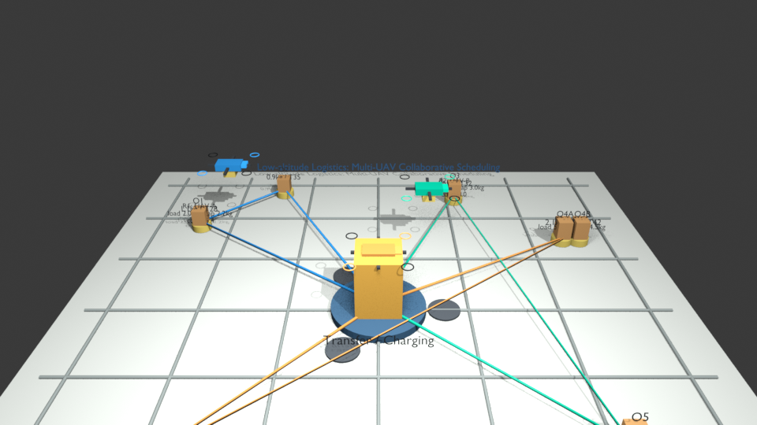
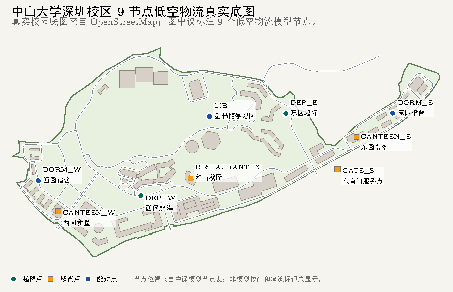
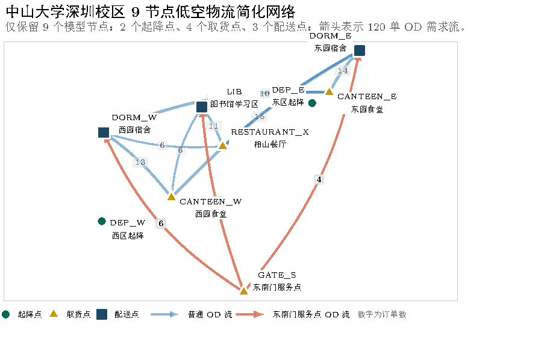
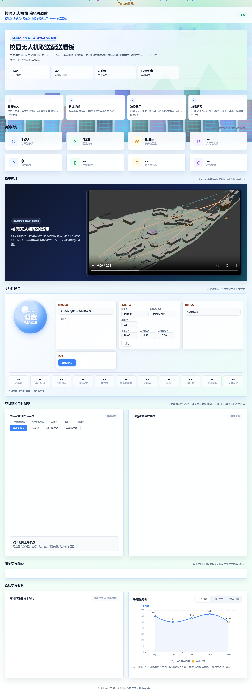

<CityDroneBackground />

  

    
    

      
Operations Research Final Presentation

      
严格依据 SYSU.palte.tex · 低空物流多无人机调度

    

  

  <h1 class="mt-5">低空物流服务优化</h1>
  <h2 class="mt-3 !text-3xl !font-700">基于中山大学深圳校区的多无人机协同调度</h2>
  

    研究多起降点、多取货点、多配送点、载重约束、电池约束和服务时间窗约束下的多无人机协同调度问题。
  

  

    
<b>对象</b>9 个校园低空物流节点

    
<b>数据</b>120 单主场景 + 300 单压力场景

    
<b>方法</b>随机搜索基线 + 遗传算法优化

  

---

<CityDroneBackground />

  <h2 class="mt-2">汇报目录</h2>
  

    
01<b>引言</b><small>背景、问题、贡献、反馈改进</small>

    
02<b>数据与场景构建</b><small>9 节点、订单、参数</small>

    
03<b>问题描述与符号定义</b><small>I、J、V、R_i 与路线层级</small>

    
04<b>数学模型</b><small>飞行时间、能耗、可行性、集合划分</small>

    
05<b>算法设计与实现</b><small>编码、解码、随机搜索、GA</small>

    
06<b>实验设计与结果分析</b><small>120 单、300 单、优化分解</small>

    
07<b>模型选择与淘汰</b><small>保留随机搜索与遗传算法</small>

    
08<b>前端可视化与系统实现</b><small>看板、地图、甘特图、解释面板</small>

    
09<b>结论与展望</b><small>项目闭环与后续方向</small>

  

  
根据汇报大论文编排的此次汇报PPT

---

<CityDroneBackground />

  

    
01 引言

    <h2 class="mt-2">研究背景、问题与贡献</h2>
    

      校园即时配送具有短距离、高频次、强时效、空间集中特征。项目核心不是“画出一条航线”，而是在多订单、多约束、多无人机协同条件下给出可执行、可解释、可复现的整体调度方案。
    

    

      
<b>研究问题</b>给定校园网络、机队参数和时间窗订单，决定启用无人机、订单分配、批次合并与多趟飞行。

      
<b>反馈改进</b>补充集合规模、任务层级和“不拆单，只做订单合并/批次装载/多趟调度”的边界。

      
<b>模型贡献</b>候选方案集合划分，表达覆盖、启用、载重、电量、时间窗和换电约束。

      
<b>工程贡献</b>随机搜索与遗传算法求解器，前端展示低空走廊、路线和调度解释。

    

  

  

---

<CityDroneBackground />

  

    
02 数据与场景构建

    <h2 class="mt-2">校园低空物流网络：9 个节点</h2>
    

      校园网络抽象为 2 个起降点、4 个取货点、3 个配送点；距离矩阵采用实际飞行走廊距离，而非单纯欧氏距离。
    

    <NodeExplorer />
  

  

    

      
      
    

    

      
<b>120 单</b>重量 0.30-1.49 kg，平均时间窗 19.4 min

      
<b>300 单</b>重量 0.27-1.41 kg，平均时间窗 20.5 min

      
<b>主要 OD</b>西园/东园食堂与东西宿舍、图书馆之间的高频流量

    

  

---

<CityDroneBackground />

  
03 问题描述与符号定义

  <h2 class="mt-2">订单、趟次、调度方案的层级关系</h2>
  

    
订单 j <small>p_j, q_j, w_j, S_j, [a_j,b_j]</small>

    
单趟路线 <small>a → p → q → ... → a</small>

    
候选方案 R_i <small>同一无人机连续多趟</small>

    
集合划分 <small>每个订单恰好覆盖一次</small>

  

  <SymbolLatexPanel />
  

    
<b>不可拆单</b>单个订单不拆给多架无人机

    
<b>可合单</b>同一趟可合并若干订单

    
<b>可多趟</b>同一无人机可连续执行多趟

  

---

<CityDroneBackground />

  

    
04 数学模型

    <h2 class="mt-2">飞行时间、能耗、单趟可行性与集合划分</h2>
    <ProcessStepper mode="model" />
  

  

    <h3 class="!text-2xl">目标函数口径</h3>
    
综合成本由四部分组成，所有算法通过统一评估器计算。

    

      
<b>启用成本</b>F = 2.0，由 0.5 起按 0.1 步长试调，综合启用规模、能耗与准时性后确定。

      
<b>能耗成本</b>α = 0.001，将 Wh 折算到目标函数成本。

      
<b>超时惩罚</b>γ = 10.0，对晚于时间窗的订单计罚。

      
<b>换电惩罚</b>ρ = 0.1，并考虑 5 min 换电时间。

    

    
<strong>建模边界</strong>
模型不把问题简化为最短路，而是把订单覆盖、起降点选择、批次装载、能耗、电量和时间窗统一评价。

  

---

<CityDroneBackground />

  

    
05 算法设计与实现

    <h2 class="mt-2">分配染色体 → 队列装箱 → 严格仿真评估</h2>
    <ProcessStepper mode="algorithm" />
  

  

    <h3 class="!text-2xl">最终保留两类算法</h3>
    

      
<b>随机搜索基线</b>按重量排序的智能随机分配，对 1-20 架启用规模分别尝试 500 次，保留当前最低成本方案。

      
<b>遗传算法主方法</b>种群 100、进化 500 代、锦标赛选择、均匀交叉、精英保留、0.15 概率变异。

      
<b>统一评估器</b>所有候选解都被解码成具体批次、趟次和路线段，再计算成本、能耗、超时和启用数量。

    

  

---

<CityDroneBackground />

  
06 实验设计与结果分析

  <h2 class="mt-2">点击切换 120 单与 300 单实验结果</h2>
  <ResultSwitcher />
  

    
<b>实验设置</b>固定随机种子 2026，使结果差异主要来自搜索策略本身。

    
<b>120 单解释</b>GA 启用 16 架而非 14 架，但减少 7302 Wh 并实现零超时。

    
<b>300 单解释</b>两类算法均启用 20 架，GA 通过分配重组大幅压缩严重时间窗违约。

  

---

<CityDroneBackground />

  
07 模型选择与淘汰

  <h2 class="mt-2">为什么最终只保留随机搜索与遗传算法</h2>
  

    
<b>MILP</b>理论清晰，但订单规模扩大后求解负担明显。

    
<b>Clarke-Wright</b>局部距离改进明显，但对时间窗、电量、绕行不稳定。

    
<b>最近邻</b>容易局部最优，把后续订单推入不合适时序。

    
<b>单任务分配</b>无法体现批次合并和多趟复用，订单规模大时成本高。

    
<b>固定批次</b>过早固定组合后，难以重新组织空间邻近、时间窗相容订单。

  

  

    
小规模可接受

    
120/300 单稳定

    
统一评估器可解释

    
最终保留：随机搜索 + GA

  

  
<strong>论文原文结论</strong>
其他备选模型弃用的主要原因是早期效果不好：要么成本较高，要么超时较多，要么放大到主数据集后不够稳定。

---

<CityDroneBackground />

  
  

    
08 前端可视化与系统实现

    <h2 class="mt-2">模型输入、算法求解、结果解释在同一看板闭环</h2>
    

      前端采用单页 HTML 看板，从 data 目录读取节点、订单、无人机参数、敏感性分析结果和算法输出。
    

    

      
<b>空间路径地图</b>展示起降点、取货点、配送点、载货段和空载段。

      
<b>时间线甘特图</b>展示每架无人机多趟任务占用与完成时间。

      
<b>算法对比</b>展示随机搜索与遗传算法的成本对照。

      
<b>调度解释</b>每架无人机覆盖订单、累计重量和预计完成时间。

    

    <a class="link-button mt-5" href="https://banyanz.github.io/slidev/zjrwork/frontend/%E5%AE%9E%E9%AA%8C%E6%95%B0%E6%8D%AE%E9%9D%A2%E6%9D%BF.html" target="_blank">打开前端看板</a>
  

---

<CityDroneBackground />

  
09 结论与展望

  <h2 class="mt-2">从数据建模、数学规划、启发式求解到前端展示的闭环</h2>
  

    
<b>结论 1</b>校园配送被抽象为带时间窗、载重和能耗约束的多无人机车辆路径问题。

    
<b>结论 2</b>遗传算法在 120 单场景实现零超时并降低能耗，在 300 单压力场景显著降低成本和违约时间。

    
<b>结论 3</b>前端可视化把模型结果从黑箱数字转为可被讨论的路线方案。

  

  

    
展望 1<b>滚动优化</b><small>将全天订单切分连续时间片，实现实时派单。</small>

    
展望 2<b>局部精修</b><small>加入 2-opt、跨无人机交换或大邻域搜索。</small>

    
展望 3<b>空域模型</b><small>纳入高度、建筑障碍、起降坪容量和天气扰动。</small>

    
展望 4<b>真实校准</b><small>接入真实订单和飞行日志，校准能耗与服务时间。</small>

  

  
一句话概括：项目将校园低空物流从“航线展示”推进到“可计算、可比较、可解释的调度方案”。

---

<CityDroneBackground />

  
小组任务分工

  <h2 class="mt-2">论文原文分工口径</h2>
  

    
<b>谢沛桦</b>数据建模、问题抽象、数学规划模型构建、遗传算法/随机搜索算法设计、飞行走廊初步设计。

    
<b>朱家良</b>中深地图数据收集与处理，建立地图数据结构，配合完成飞行走廊最终设计。

    
<b>王志轩</b>无人机参数收集、数学建模参数设计与优化，并参与算法设计和结果分析。

    
<b>黄宇鑫</b>前端可视化系统设计与实现，包括地图展示、甘特图和交互控制台。

    
<b>张家榕</b>实验设计、结果分析和论文撰写，对中深地图进行数据收集与可视化设计，搭建 Blender 模型并优化前端网页。

  

---

<CityDroneBackground />

  

    
谢谢倾听

    
低空物流服务优化 · 中山大学深圳校区多无人机协同调度

  

